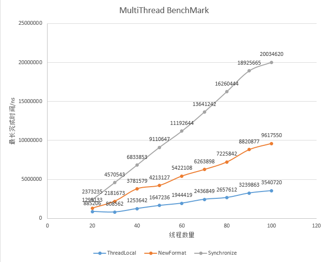

# DecimalFormat Benchmark

由于 DecimalFormat 是非线程安全的，故针对其使用有如下三种方法：

- Synchronize: 使用 synchronize 关键字同步 DecimalFormat 的获取方法，以实现不同线程对 DecimalFormat 的串行访问
- ThreadLocal: 使用 java.lang.ThreadLocal 获取当前线程中新创建且唯一的 DecimalFormat，即通过将 DecimalFormat 对象作用范围限制在线程范围内保证线程安全
- NewFormat: 在需要使用 DecimalFormat 的地方新创建此对象

为了选出最优的做法，进行测试

## 1 单线程下的测试

每种方法都使用十次，取其平均值作为此种方法下的代表值

```text
ThreadLocal	379.648 ns / iteration
NewFormat	661.212 ns / iteration
Synchronize	173.584 ns / iteration
```

从结果来看，Synchronize 方法最优，ThreadLocal 方法次之，NewFormat 方法最差。

## 2 多线程下的测试

对每种方法启动多个线程，每个线程都完全执行在单线程测试下执行的操作。以结束时间最晚的那个线程的运行时间作为此种方法下的代表值。

```text
ThreadLocal	885206 ns for max iteration of total thread count 10
NewFormat	1295133 ns for max iteration of total thread count 10
Synchronize	2373235 ns for max iteration of total thread count 10
ThreadLocal	808562 ns for max iteration of total thread count 20
NewFormat	2181673 ns for max iteration of total thread count 20
Synchronize	4570543 ns for max iteration of total thread count 20
ThreadLocal	1253642 ns for max iteration of total thread count 30
NewFormat	3781579 ns for max iteration of total thread count 30
Synchronize	6833853 ns for max iteration of total thread count 30
ThreadLocal	1647236 ns for max iteration of total thread count 40
NewFormat	4213127 ns for max iteration of total thread count 40
Synchronize	9110647 ns for max iteration of total thread count 40
ThreadLocal	1944419 ns for max iteration of total thread count 50
NewFormat	5422108 ns for max iteration of total thread count 50
Synchronize	11192644 ns for max iteration of total thread count 50
ThreadLocal	2436849 ns for max iteration of total thread count 60
NewFormat	6263898 ns for max iteration of total thread count 60
Synchronize	13641242 ns for max iteration of total thread count 60
ThreadLocal	2657612 ns for max iteration of total thread count 70
NewFormat	7225842 ns for max iteration of total thread count 70
Synchronize	16260444 ns for max iteration of total thread count 70
ThreadLocal	3239863 ns for max iteration of total thread count 80
NewFormat	8820877 ns for max iteration of total thread count 80
Synchronize	18925665 ns for max iteration of total thread count 80
ThreadLocal	3540720 ns for max iteration of total thread count 90
NewFormat	9617550 ns for max iteration of total thread count 90
Synchronize	20034620 ns for max iteration of total thread count 90
```



从测试结果来看，相较于 NewFormat 和 Synchronize，ThreadLocal 还是有一定优势的。

## 3 Reference

- [SO Thread: What are the performance impacts of using DecimalFormat with ThreadLocal?
](https://stackoverflow.com/questions/45370011/what-are-the-performance-impacts-of-using-decimalformat-with-threadlocal)
- [Double-checked locking: Clever, but broken](https://www.javaworld.com/article/2074979/double-checked-locking--clever--but-broken.html)
  - Unfortunately, synchronized methods run much slower -- as much as 100 times slower -- than ordinary unsynchronized methods. 