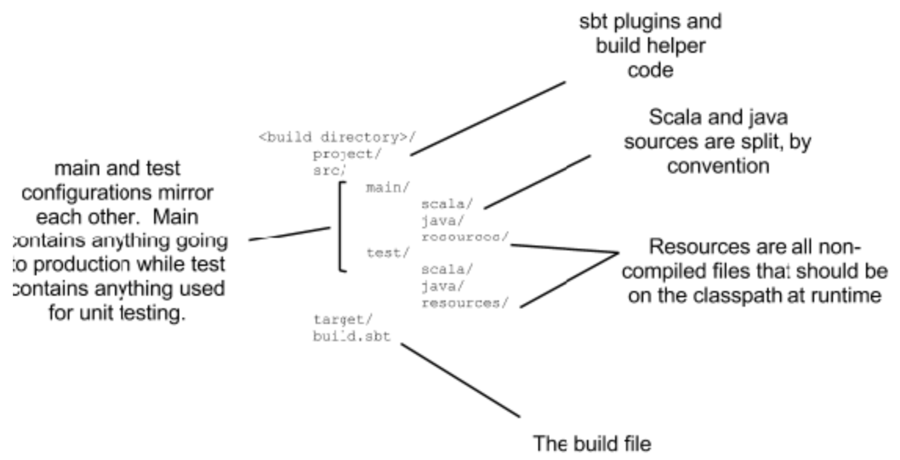

# Scala Akka Http Demo

## 1 Build and Run

- Compile: `sbt compile`
- Test: `sbt test`
- Run: `sbt run com.langinteger.Main`
- Debug in `sbt`:
  - Start server in background: `reStart`

- Usage: send message to `localhost:8081/v1/log/recordLog` with `Post` method, log will be recorded and response with proper result
- Example `v1/log/recordLog`:

``` sh
curl -D - \
     -H "Content-Type: application/json" \
     -X POST \
     -d '{ "test": "test" }' \
     "http://localhost:8081/v1/log/recordLog"
```
### 1.1 Work with sbt

Download sbt from [scala-sbt org downloading page](https://www.scala-sbt.org/download.html)

Setting the PATH in bash(for linux/mac)

- With command `vim ~/.bash_profile`
- Add the following lines
```text
 SBT_HOME=/path/to/your/zip/extraction
   PATH=$PATH:$SBT_HOME/bin
   export PATH
```
- Refresh with `source ~/.bash_profile`

### 1.2 Running sbt

#### 1.2.1 Setting up a build

Using sbt depends on two files:

- project/build-properties: define sbt version
- build.sbt: actual settings for this build

Sbt includes settings for a default project with these two fields inside. However, it's a good practice to always manually create the files in project.

#### 1.2.2 sbt command

Enter sbt command prompt:

> sbt

In sbt command prompt, try following commands

- compile: compile files to `.class` file
- scalaSource/javaSource: finding scala/java source code location
- run: run the application
- test: run test


#### 1.2.3 Default project layout

sbt pre-baked settings and conventions for project layout:



#### 1.2.4 Define settings

- `:+`: Assigns an initialization expression to a key. Overrides any previous value
- `+=`: Appends an initialization expression to the existing sequence in a key
- `++=`: Appends an initialization of a sequence of values to the existing sequence in a key

#### 1.2.5 Creating and executing tasks

Create a new key which can store the value of the git commit (it's a `definition`):

```text
val gitHeadCommitSha = taskKey[String]("Determines the current git commit SHA")
```

Define a new setting which will grab the value of the sha and place it in the setting:

```text
gitHeadCommitSha := Process("git log --oneline").lineStream.head
```

Execute task with:

```text
show gitHeadCommitSha
```

#### 1.2.6 Using configurations

Configurations are namespaces for keys.

- Compile: settings and values used to compile the main project and generate production artifacts
- Test: settings and values used to compile and run unit testing code
- Runtime: settings and values used to run your project within sbt
- IntegrationTest: settings and values used to run tests against your production artifacts

#### 1.2.7 The Default Build

##### Compiling Code

Compilation requires three things:

- A sequence of source files
- A sequence of libraries
- A sequence of compiler configuration options

##### Major tasks

Major tasks within a project development lifecycle:

- **update**: resolve external dependencies
- **compile**: compile your code
- **package**: build a distributable JAR of your project
- **publish**: push your project into Ivy, for other projects to depend on it

- UnManaged sources make use 


- IDEA: file => open => find root directory
- Start server with `com.langinteger.Main`
- send message to `localhost:8081/v1/log/recordLog` with `Post` method, log will be recorded and response with proper result

## 2 Key Point

### 2.1 Router

#### Router with DSL

```text
case class HelloWorldWithDslRoute() {

  val helloWorldWithDslRoute: Route =
    path("hello") {
      get {
        complete(HttpEntity(ContentTypes.`text/plain(UTF-8)`, "<h1>Say hello to akka-http</h1>"))
      }
    }
}
```

#### Router with plain code

```text
case class HelloWorldWithPlainRoute() {

  val complete1: StandardRoute = complete("Say hello to akka-http")
  val route1: Route = get(complete1)
  val path1: Directive0 = path("hello1")
  val helloWorldWithPlainRoute: Route = path1.apply(route1)
}
```

#### Difference

[Reference](https://blog.csdn.net/gongpulin/article/details/53889922)

### 2.2 Marshalling/Unmarshalling

With dependency: 

```text
"de.heikoseeberger" %% "akka-http-jackson" % "1.27.0"
```

Dig into `akka-http-jackson JacksonSupport.scala`:

```text
  /**
    * HTTP entity => `A`
    */
  implicit def unmarshaller[A](
      implicit ct: TypeTag[A],
      objectMapper: ObjectMapper = defaultObjectMapper
  ): FromEntityUnmarshaller[A] =
    jsonStringUnmarshaller.map(
      data => objectMapper.readValue(data, typeReference[A]).asInstanceOf[A]
    )

  /**
    * `A` => HTTP entity
    */
  implicit def marshaller[Object](
      implicit objectMapper: ObjectMapper = defaultObjectMapper
  ): ToEntityMarshaller[Object] =
    Jackson.marshaller[Object](objectMapper)
```

Refer to [Akka HTTP testing](http://blog.madhukaraphatak.com/akka-http-testing/)

### 2.3 API for project version with git commit SHA

With tasks `gitHeadCommitSha` and `makeVersionProperties` to create `version.properties` in class path for version reading in runtime.

Try `localhost:8081/v1/version` with `GET` to get current project version, or git commit SHA specifically.
